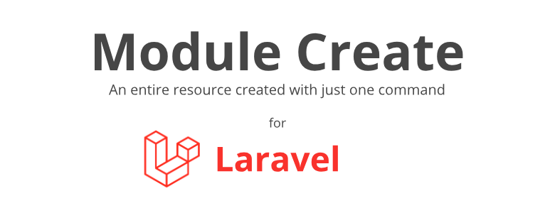

<div style="align-content: center; align-items: center; text-align: center;">
   

# Laravel Module Create


</div>


Laravel Module Create is a complete module create for Laravel.
-----

To create the suggested structures, the execution options are shown below. To create a "Project", it will be created within the default "app" directory with the name of your project where all the modules will be located.

To create the modules or the complete skeleton of the module, you must also inform your project, as shown in each command.

After executing the skeleton creation, the Providers for registration will be displayed.

Remember that Laravel 10 and 11 have different places for declaring Providers.

## This library create structure below

```text
└── MyProject 
    ├── Commons
        └── Traits
            ├── RouteServiceProviderTrait.php
            └── SoftDeletes.php
    └── MyModules
        ├── Controllers
            └── Api
                └── MyModuleController.php
        ├── Models
            ├── MyModule.php
            └── Repositories
                ├── MyModuleRepositoryInterface.php
                └── MyModuleRepository.php
        ├── Providers
            ├── AppServiceProvider.php
            └── RouteServiceProvider.php
        ├── Requests
            └── MyModuleRequest.php
        ├── Resources
            ├── MyModuleCollection.php
            └── MyModuleResource.php
        ├── Routes
            ├── api.php
            └── web.php
        └── Services
            └── MyModuleService.php
```

-----

## Commands

### To create a project:
```bash
php artisan lm-create:project MyProject
```

### To create a module:
```bash
php artisan lm-create:module MyProject MyModule
```

### To create a scaffold:
```bash
php artisan lm-create:skeleton MyProject MyModule
```

### To create a basic scaffold:
```bash
php artisan lm-create:basic MyProject MyModule
```

#### This command creates the basic structure below
```text
└── MyProject 
    ├── Commons
        └── Traits
            └── SoftDeletes.php
    └── MyModules
        ├── Models
            ├── MyModule.php
            └── Repositories
                ├── MyModuleRepositoryInterface.php
                └── MyModuleRepository.php
        ├── Providers
            └── AppServiceProvider.php
        └── Services
            └── MyModuleService.php
```

---

### If you need compound names, use quotes
This is valid for Projects, Modules and Skeleton

Eg. Project:
```bash
php artisan lm-create:project 'My Project'
```
Eg. Module or Skeleton:
```bash
php artisan lm-create:module 'My Project' 'My Module'
php artisan lm-create:skeleton 'My Project' 'My Module'
```

### TO DO List

| Resource                       | Description                                                                                    | Category |
|--------------------------------|------------------------------------------------------------------------------------------------|----------|
| [v] Run in production          | Not is running by artisan                                                                      | FEAT     |
| [V] Basic Skeleton             | Create basic skeleton to usage model                                                           | FEAT     |
| [ ] Generate Migrations        | Generate a command to create a migration for the created module and output it along with the information for logging.                                                           | FEAT     |
| [ ] Generate Unit Tests        | Generate a basic structure for unit testing the module.                                                           | FEAT     |
| [ ] Generate Integration Tests | Generate a basic structure for integration testing the module.                                                           | FEAT     |


### FIX BUGS

| Resource              | Description                                                                                    | Category |
|-----------------------|------------------------------------------------------------------------------------------------|----------|
| [v] No replace        | If module was created but, not is complete, in new generate cannot replace if exists resources | BUG      |
| [v] Namespace         | Modules with compound names are not generating namespaces correctly                            | BUG      |


## For Developers

```shell
composer install
```

### Commands:
```shell
php src/Config/lm-create-dev.php -f project:MyProject
```
```shell
php src/Config/lm-create-dev.php -f module:MyProject:MyModule
```
```shell
php src/Config/lm-create-dev.php -f skeleton:MyProject:MyModule
```
```shell
php src/Config/lm-create-dev.php -f basic:MyProject:MyModule
```